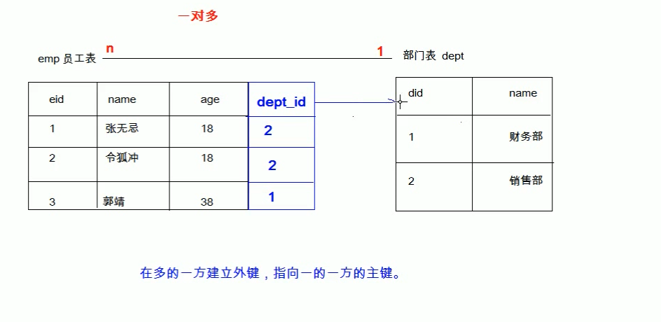
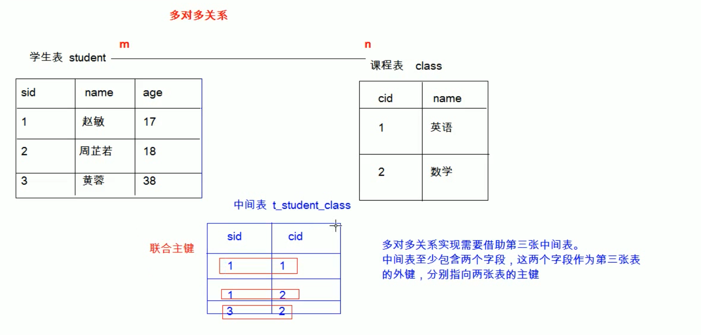

# 09 多表操作

## 数据库的设计

1. 多表之间的关系

   1. 分类
      1. 一对一（了解）：
         - 如：人和身份证
         - 分析：一个人只有一个身份证，一个身份证只能对应一个人
      2. 一对多（多对一）：
         - 如：部门和员工
         - 分析：一个部门有多个员工，一个员工只能对应一个部门
      3. 多对多
         - 如：学生和课程
         - 分析：一个学生可以选择很多门课程，一个课程也可以被很多学生选择

   2. 实现关系

      1. 一对多（多对一）：

         - 如：部门和员工
         - 实现方式：在多的一方建立外键，指向一的一方的主键

         

      2. 多对多：

         - 如：学生和课程
         - 实现方式：多对多关系实现需要借助第三张中间表

         ​         
         
      3. 一对一（了解）：
      
         - 如：人和身份证
         - 实现方式：一对一关系实现，可以在任意一方添加唯一外键指向另一方的主键
         - 注意：如果出现一对一关系，一般放在一张表中
      
      4. 案列分析：查看当前文件夹同级 《MySQL约束与设计》

2. 数据库设计的范式

   - 概念：好的数据库设计对数据的存储性能和后期的程序开发，都会产生重要的影响。建立科学的，规范的数据库就需要满足一些规则来优化数据的设计和存储，这些规则就称为范式。
   
   - 三大范式： 
   
     - 目前关系数据库有六种范式：
   - 第一范式（**1NF**）、第二范式（**2NF**）、第三范式（**3NF**）、巴斯**-**科德范式（**BCNF**）、第四范式**(4NF**）和第五范式（**5NF**，又称完美范式）。
       - 满足最低要求的范式是第一范式（**1NF**）。在第一范式的基础上进一步满足更多规范要求的称为第二范式（**2NF**），其余范式以次类推。一般说来，数据库只需满足第三范式**(3NF**）就行了。 
   
   - 几个概念：
   
     1. 函数依赖：A —> B，如果通过 A 属性（属性组）的值，可以确定唯一 B 属性的值。则称 B 依赖于 A
   
        例如：学号 —> 姓名  （学号、课程名称）  —> 分数
   
     2. 完全函数依赖：A —> B,如果 A 是一个属性组，则 B 属性值得确定需要依赖于 A 属性组中所有的属性值。
   
        例如：（学号，课程名称） —>  分数
   
     3. 部分函数依赖：A —> B，如果 A 是一个属性组，则 B 属性值得确定只需要依赖于 A 属性组中某一些值即可。
   
        例如：（学号，课程名称） —>  姓名
   
     4. 传递函数依赖：A —> B，B —> C，如果通过 A 属性（属性组）的值，可以确定唯一 B 属性的值，在通过 B 属性（属性组）的值可以确定唯一 C 属性的值，则称 C 传递函数依赖于 A
   
        例如：学号 —> 系名，系名 —> 系主任
   
     5. 码：如果在一张表中，一个属性或属性组，被其他所有属性所完全依赖，则称这个属性（属性组）为该表的码
   
        例如：该表中码为：（学号，课程名称）
   
        - 主属性：码属性组中的所有属性
        - 非主属性：除过码属性组的属性
   
   - 分类：
   
     1. 第一范式（1NF）：每一列都是不可分割的原子数据项
     2. 第二范式（2NF）：在 1NF 的基础上，非码属性必须完全依赖于码（在 1NF 基础上消除非主属性对主码的部分函数依赖）
     3. 第三范式（3NF）：在 2NF 的基础上，任何非主属性不依赖于其它非主属性（在 2NF 基础上消除依赖传递）

