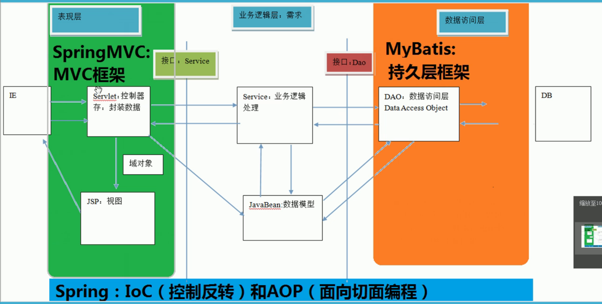

# 01.Spring框架简介

spring 共四天

第一天：spring 框架的概述及 spring 中基于 XML 的 IOC 配置

第二天：spring 中基于注解的 IOC 和 ioc 的案例

第三天：spring 中的 aop 和基于 XML 以及注解的 AOP 配置

第四天： spring 中的 JdbcTemlate 以及 Spring 事务控制

**本节目录**

**spring 的概述**

- spring 是什么
- spring 的两大核心
- spring 的发展历程和优势
- spring体系结构

**程序的耦合及解耦**

- 曾经案例中问题
- 工厂模式解耦

**IOC 概念和 spring 中的 IOC**

spring 中基于 XML 的 IOC 环境搭建

**依赖注入（Dependency Injection）**

**作业**

#### spring 概述

Spring 是分层的 Java SE/EE 应用 full-stack 轻量级开源框架，以 **IoC（Inverse Of Control: 控制反转）**和 **AOP（Aspect Oriented Programming：面向切面编程**）为内核，提供了展现层 Spring MVC 和持久层 Spring JDBC 以及业务层事务管理等众多的企业级应用技术，还能整合开源世界众多著名的第三方框架和类库，逐渐成为使用最多的 Java EE 企业应用开源框架。

**spring 优势**

**方便解耦，简化开发**

​	通过 Spring 提供的 IoC 容器，可以将对象间的依赖关系交由 Spring 进行控制，避免硬编码所造成的过渡程序耦合。用户也不必再为单例模式类、属性文件解析等这些很底层的需求编写代码，可以更专注于上层的应用。

**AOP 编程的支持**

​	通过 Spring 的 AOP 功能，方便进行面向切面的编程，许多不容易用传统 OOP 实现的功能可以通过 AOP 轻松应付。

**声明式事务的支持**

​	可以将我们从单调烦闷的事务管理代码中解脱出来，通过声明式方式灵活的进行事务的管理，提高开发效率和质量。

**方便程序的测试**

​	可以用非容器依赖的编程方式进行几乎所有的测试工作，测试不再是昂贵的操作，而是随手可做的事情。

**方便集成各种优秀框架**

​	Spring 可以降低各种框架的使用难度，提供了对各种优秀框架（Struts、Hibernate、Hessian、Quartz等）的直接支持。

**降低 JavaEE API 的使用难度**

​	Spring 对 JavaEE API（如 JDBC、JavaMail、远程调用等）进行了薄薄的封装层，使这些 API 的使用难度大为降低。

**Java 源码是经典学习范例**

​	Spring 的源代码设计精妙、结构清晰、匠心独用，处处体现着大师对 Java 设计模式灵活运用以及对 Java 技术的高深造诣。它的源代码无疑是 Java 技术的最佳实践范例。

​	

