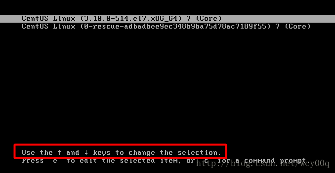
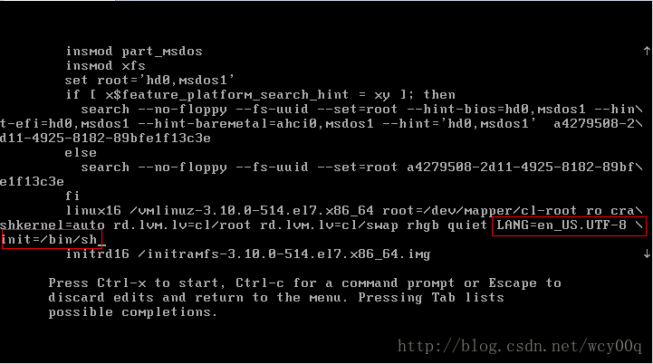
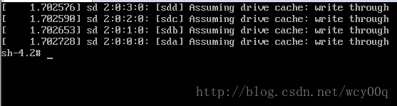

应用场景
linux管理员忘记root密码，需要进行找回操作。 
注意事项：本文基于centos7环境进行操作，由于centos的版本是有差异的，继续之前请确定好版本。

操作步骤
一、重启系统，在开机过程中，快速按下键盘上的方向键↑和↓。目的是告知引导程序，我们需要在引导页面选择不同的操作，以便让引导程序暂停。 
以下是暂停后的界面，可以查看下方的英文可知↑和↓的作用。

二、使用↑和↓将选择行设置为第一行（背景高亮即为选中），按下键盘上的e，进入编辑模式

三、将光标一直移动到 LANG=en_US.UTF-8 后面，空格，再追加init=/bin/sh。这里特别注意，需要写在UTF-8后，保持在同一行，并注意空格。由于屏幕太小，会自动添加\换行，这个是正常的。

四、按下CTRL+X进行引导启动，成功后进入该界面

五、输入以下命令

1、挂载根目录 Ï
mount -o remount, rw /

2、选择要修改密码的用户名，这里选择root用户进行修改，可以更换为你要修改的用户 
passwd root

3、输入2次一样的新密码，注意输入密码的时候屏幕上不会有字符出现。 
如果输入的密码太简单，会提示警告（BAD PASSWORD：The password fails the dictionary check - it is too simplistic/systematic），可以无视它，继续输入密码，不过建议还是设置比较复杂一些的密码，以保证安全性

4、如果已经开启了SElinux，则需要输入以下命令 
touch /.autorelabel

5、最后输入以下命令重启系统即可
