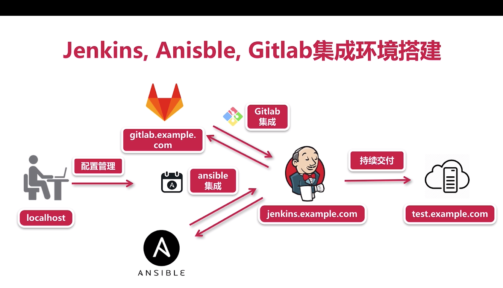

# 4、实战 Gitlab + Ansible + Jenkins 持续交付

在产品部署中，利用 Ansible 高效可靠的将产品交付到服务器中，在出现任何问题都能用 Jenkins 及时定位并解决。

Gitlab 则会在产品的部署前期用来保存写好的部署脚本，并在后期使用 Gitlab 的版本控制机制，定位脚本的功能以及潜在的问题。

总结：

Jenkins首先从Gitlab去抓取我们写好的具体产品的playbook, 并使用virtualenv下的Ansible相关命令, 保证我们在一个clean的环境下使用stable version去批量部署我们的产品到远程client.

